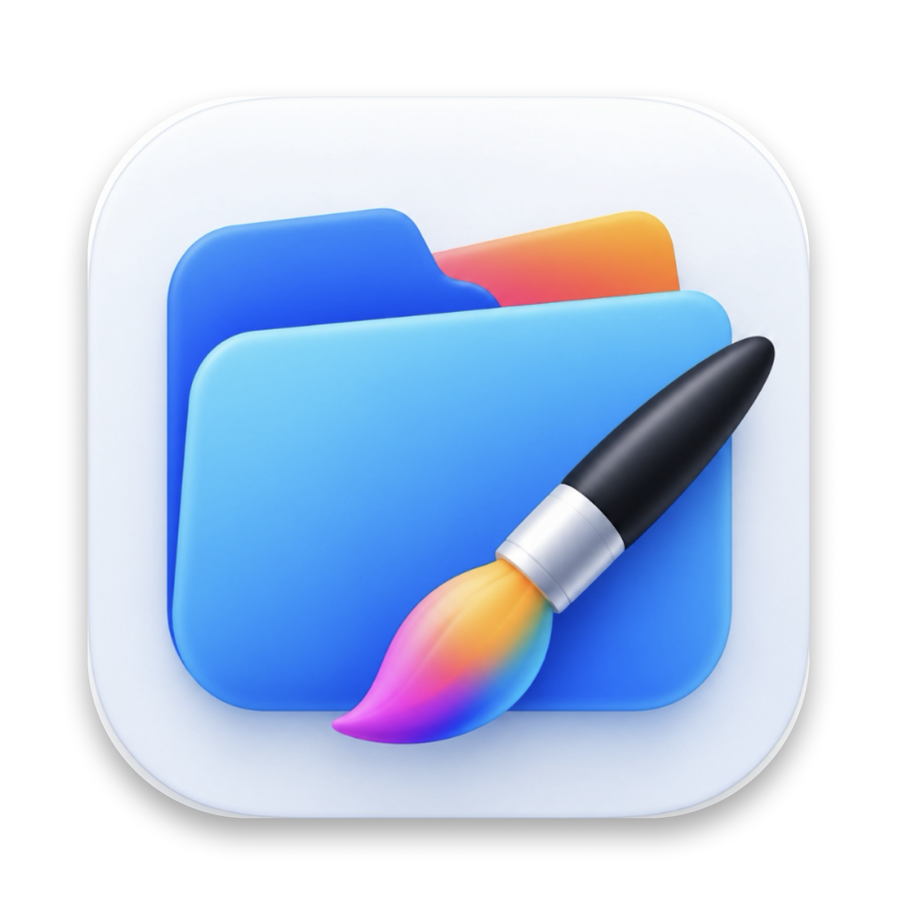
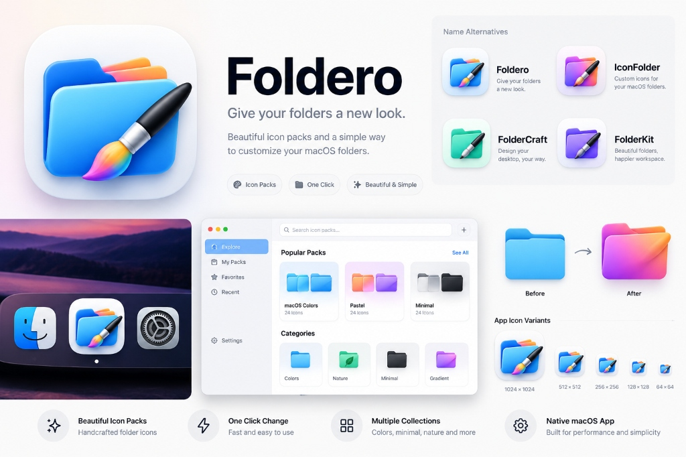
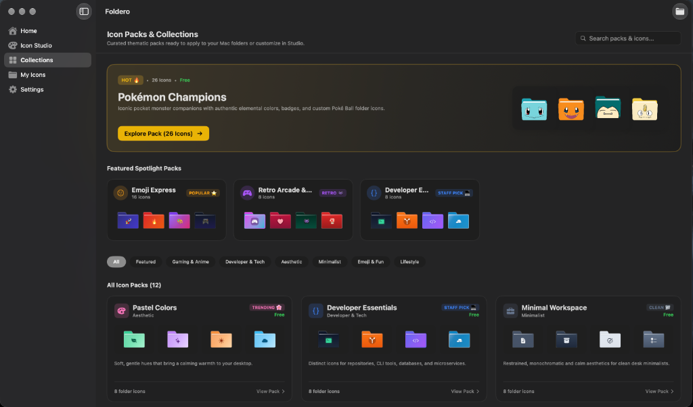
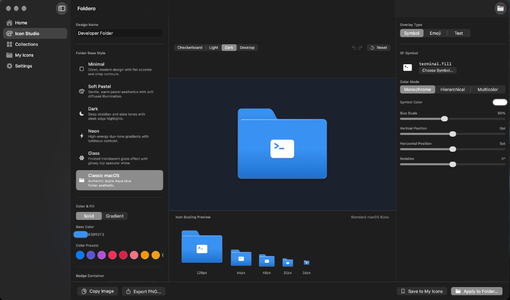
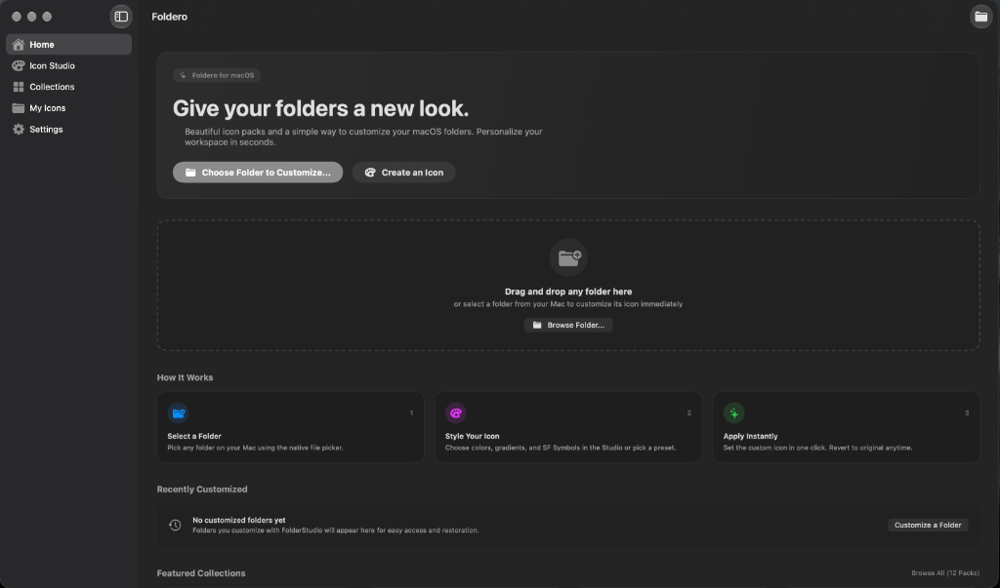

<div align="center">



# Foldero

### *Give your folders a new look.*
**Beautiful icon packs and an effortless way to customize your macOS folders.**

[-000000.svg?style=for-the-badge&logo=apple&logoColor=white)](https://apple.com/macos)
[](https://swift.org)
[](https://developer.apple.com/xcode/swiftui/)
[](LICENSE)
[](https://github.com/bhargavdetroja/FolderStudio/releases)

<br/>



</div>

<br/>

## 🌟 Overview

**Foldero** is a native, modern macOS application designed to bring vibrant personality, visual clarity, and clean organization to your Mac. Say goodbye to the sea of uniform blue folders!

With Foldero, you can customize any folder on your Mac in **one single click**—choose from a curated catalog of designer icon packs (like **Pokémon Champions**, **macOS Pastel**, and **Minimalist Mono**), or launch the built-in **Icon Studio** to craft your own bespoke designs with Apple SF Symbols, emoji badges, custom tints, and gradients.

---

## ✨ Key Features

| Feature | Description |
| :--- | :--- |
| 🎨 **Curated Icon Packs** | High-definition, handcrafted folder icon sets including Pokémon Champions (Squirtle, Charmander, Snorlax, Poké Balls, Master Balls), Pastel, Minimal, and Developer collections. |
| ⚡ **One-Click Customization** | Drag and drop any folder directly from Finder, select an icon, and watch your folder transform instantly. |
| 🛠️ **Built-in Icon Studio** | Create unique icons with custom background colors, linear/radial gradients, Apple SF Symbols, emoji overlays, and custom typography. |
| 🗂️ **Categorized Storefront Catalog** | Browse packs by category (*Featured*, *Anime*, *Aesthetics*, *Minimal*, *Developer*), complete with spotlight hero banners and interactive preview cards. |
| 🛡️ **Native APFS & 100% Safe** | Uses macOS's native `Icon\r` resource streams. Foldero **never** modifies, moves, or touches your actual files or folder contents. |
| ↩️ **Instant Reset** | Restore any folder back to Apple's default blue state with a single click at any time. |
| 🔒 **Sandboxed & Private** | Operates strictly within the macOS App Sandbox using user-granted security-scoped bookmarks. No telemetry, no network calls, 100% offline. |

---

## 📸 App Showcase & Screenshots

<div align="center">

### 1. Curated Icon Packs & Storefront
*Explore curated thematic packs including Pokémon Champions, Developer Essentials, Minimalist Workspace, and Pastel Colors with category filters and instant previews.*



<br/><br/>

### 2. Built-in Icon Studio
*Craft bespoke folder icons with Apple SF Symbols, emoji overlays, gradient fills, custom accent colors, and real-time multi-resolution scaling previews.*



<br/><br/>

### 3. Home Dashboard & Instant Drop Zone
*Drag and drop any folder directly from Finder to customize or restore Apple's default icon in a single click.*



</div>

---

## 🚀 Installation & Download

### Option 1: Direct Download (Pre-built Release)
1. Go to the [**Releases**](https://github.com/bhargavdetroja/FolderStudio/releases) page.
2. Download the latest `Foldero-macOS.dmg` or `Foldero-macOS.zip`.
3. Open the DMG and drag **Foldero** into your `/Applications` folder.
4. Launch Foldero and personalize your folders!

### Option 2: Build From Source
```bash
# 1. Clone the repository
git clone https://github.com/bhargavdetroja/FolderStudio.git
cd FolderStudio

# 2. Open project in Xcode
open FolderStudio.xcodeproj

# 3. Build & Run
# Press Cmd + R in Xcode, or build via command line:
xcodebuild -project FolderStudio.xcodeproj -scheme FolderStudio -configuration Release -destination 'platform=macOS' build
```

---

## 🛠️ How It Works Under The Hood

macOS folder icons are managed at the filesystem and Finder level through standard Apple APFS mechanisms:

1. **Native Icon Resource Stream**: When you apply an icon, Foldero renders an Apple-compliant multi-scale bitmap (from 16×16 up to 1024×1024 Retina) and attaches it via `NSWorkspace.shared.setIcon(_:forFile:options:)`.
2. **Finder Information Flag**: macOS sets the `kHasCustomIcon` bit (`0x0400`) in the directory's extended attribute `com.apple.FinderInfo`.
3. **Hidden `Icon\r` File**: A special hidden resource file (`Icon\r`) is maintained inside the directory to store the icon representation.
4. **Instant Finder Refresh**: Foldero notifies LaunchServices and the macOS CoreServices daemon to update Finder's icon cache immediately without requiring a `killall Finder` or system restart.
5. **Zero Data Risk**: Your documents, subfolders, and files inside the customized directory are completely untouched and safe.

---

## 📂 Project Architecture

```
FolderStudio/
├── FolderStudio/
│   ├── App/
│   │   └── AppState.swift               # Global reactive application state
│   ├── Models/
│   │   ├── IconCollection.swift         # Icon packs, categories & definitions
│   │   ├── IconDesign.swift             # Model representing custom icon configurations
│   │   ├── FolderStyle.swift            # Presets & color palettes
│   │   └── RecentFolder.swift           # Security-scoped folder bookmarks
│   ├── Services/
│   │   ├── FolderIconService.swift      # APFS & NSWorkspace icon setter / resetter
│   │   ├── IconRenderer.swift           # Multi-resolution CoreGraphics icon renderer
│   │   └── IconStorageService.swift     # Local icon library & persistence
│   ├── Views/
│   │   ├── Home/HomeView.swift          # Quick drag-drop dashboard & recents
│   │   ├── Collections/CollectionsView.swift # Store-style pack catalog & hero spotlight
│   │   ├── Studio/IconStudioView.swift  # Interactive visual canvas & inspector
│   │   ├── Customizer/FolderCustomizerView.swift # Folder selection & apply modal
│   │   └── Settings/SettingsView.swift  # Preferences, appearance & permissions
│   └── Assets.xcassets/
│       ├── AppIcon.appiconset/          # 3D Squircle app icon suite (16px - 1024px)
│       └── ...                          # Pack assets (Pokémon, macOS icons, etc.)
├── .github/
│   └── workflows/
│       └── build.yml                    # Automated CI/CD pipeline (macOS DMG & ZIP)
├── docs/
│   └── assets/                          # Branding banner, logos & media assets
├── LICENSE                              # MIT Open Source License
└── README.md
```

---

## 🤖 Continuous Integration & Build Pipeline

Foldero includes a pre-configured GitHub Actions workflow located at `.github/workflows/build.yml`:

- **Automated Matrix Testing**: Builds clean release binaries on Apple Silicon `macos-14` runners.
- **Artifact Packaging**: Automatically generates distributable `.dmg` and `.zip` archives.
- **One-Tag Releases**: Pushing a tag (e.g. `v1.0.0`) automatically publishes a GitHub Release with compiled release binaries and generated changelogs.

---

## 🤝 Contributing

Contributions are warmly welcome! Whether you'd like to submit new icon collections, improve the Studio UI, or add new features:

1. Fork the Project.
2. Create your Feature Branch (`git checkout -b feature/AmazingIconPack`).
3. Commit your Changes (`git commit -m 'Add AmazingIconPack'`).
4. Push to the Branch (`git push origin feature/AmazingIconPack`).
5. Open a Pull Request.

---

## 📄 License

Distributed under the **MIT License**. See [`LICENSE`](LICENSE) for more information.

---

<div align="center">
  <sub>Crafted with ❤️ for the macOS community by <a href="https://github.com/bhargavdetroja">Bhargav Detroja</a>.</sub>
</div>
